# bomblab 报告

姓名：陈子墨

学号：2024201501

| 总分 | phase_1 | phase_2 | phase_3 | phase_4 | phase_5 | phase_6 | secret_phase |
| --------- | ------------- | ------------- | ------------- | ----------------- |-----------|-----------|-----------|
| 7        | 0            | 0            | 0            | 0 |0  |0  |0  |


scoreboard 截图：

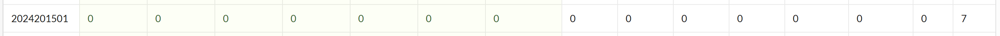

<!-- TODO: 用一个scoreboard的截图，本地图片，放到 imgs 文件夹下，不要用这个 github，pandoc 解析可能有问题 -->

## 解题报告

<!-- 对你拆掉的每个phase进行分析，并写出你得出答案的历程 -->

<!-- 如果能用伪代码还原题目源代码最佳（不属于先前提到的大段代码），语言描述自己的分析也可，每道题目的图片不建议超过两张 -->

### phase_1

```
Roki Roki Rock'n Rock'n Roll!
```

代码在内存的实际存放位置会加一个0x555555554000的基址。程序将地址0x55555555717c传入%rsi，然后调用了string_not_equal函数。如果返回值不为0就explode_bomb。所以要让两个字符串相等。查看一下第一个字符串：

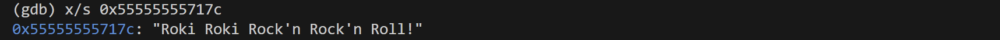

所以需要输入这个。

有趣的是，继续按回车会输出更多字符串：

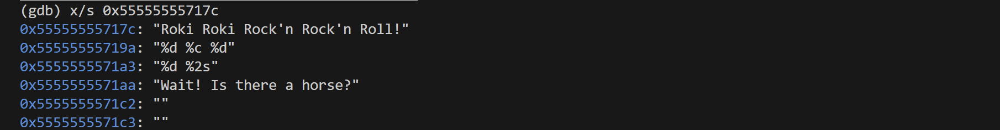

对于x命令，连续回车貌似是“继续查看下一个”而不是“重复操作”。

### phase_2

```
677782 688192 541377 768321
```

phase_2调用了sscanf函数。sscanf的第一个参数是要读取的字符串，在%rdi所指内存中（即我的输入）；第二个参数是格式字符串，在%rsi所指内存中（0x5555555575c9）。我跳出sscanf的时候，居然直接显示了细节信息：

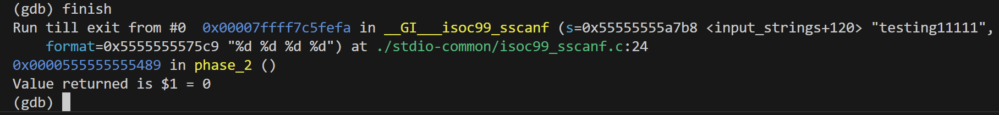

当然，也可以手动查看读取格式：

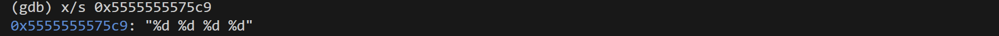

四个整数分别存在%rdx、%rcx、%r8、%r9所指内存中，即%rsp, %rsp+4, %rsp+8, %rsp+12。

我看到注释中的Mat，以及汇编中的循环，应该在做矩阵运算。

我又看了一下explode_bomb前的部分：比较%rbp+%rbx的内存值和%rsp+%rbx的内存值，而且只比较低4个字节。

我注意到explode_bomb附近有非常多的强制跳转和条件跳转，已被搞晕。无法知道它们都在干什么，也无法知道最后会不会直接跳过explode_bomb。

又细细品味了一下，%rbp+%rbx的4字节内存值和%rsp+%rbx的4字节内存值必须一直相等，这期间%rbx不断加0x4，并与0x10即16作比较，相等时跳过explode_bomb。所以应该是要比较四次！

又受到提示，不需要理解计算逻辑，只需找到程序把正确结果放在哪了：

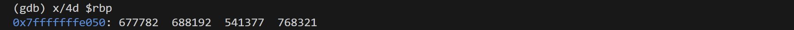

找到了。最后还有一个问题：我需要知道这四个数是我应输入的，还是我的输入经过一通运算后应得到的。

一个~~偷懒~~巧妙的方法：直接读一下另外四个数：

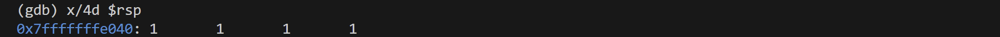

发现跟我的输入完全一致，几乎可以认为这就是我的输入。

当然，也可以根据汇编代码判断。%rsp, %rsp+4, %rsp+8, %rsp+12这些位置没有被修改过，一直存着我的原始输入。

### phase_3

```
1 K 784
```

phase_3调用了sscanf函数，读取格式为"%d %c %d"。程序从内存取了一个值给%eax，让%al跟我输入的char做异或。我查看到%al中的二进制为0100000。我又发现第一个数不能大于7。

然后我发现程序将我输入的第一个整数加载进%eax，又让它参与了奇怪的运算，最后将%rax作为跳转目标：`159f: jmp *%rax`。这表明跳转的位置跟读入的第一个数字有关，但我看不出是在做什么。

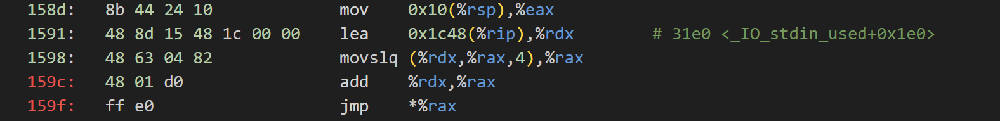

受到提示，这是在进行跳转表操作。1591加载跳转表的基地址，1598将%rax（0\~7）作为偏移量获得目标代码的地址偏移再存进%rax，159c将跳转表地址和目标代码的地址偏移相加，获得目标代码的位置。

我注意到，后面的代码包含非常多的explode_bomb，结构也非常相似：都是mov，cmpl，je，call，mov，jmp这六条语句的重复，且刚好有8组，应该对应第一个数是0\~7的情况！

不妨选择1，这个分支要求我输入的第二个数要等于0x310即784，还将0x6b加载进%eax。又要求我输入的char跟00100000做异或后要等于现在的%al即01101011，则该char应等于01001011即K。

### phase_4

```
31 AC
```

phase_4调用了sscanf函数，读取格式为"%d %2s"。然后调用了func4_1函数，其逻辑为：
$$
func4\_1(x)=\begin{cases}2^x-1,x\ge 1\\
0,x\le 0
\end{cases}
$$
程序要求我输入的整数必须等于func4_1(5)=31，因此第一个输入为31。

程序还判断string_len是否为2，不过有趣的是，我甚至可以故意多输入几个字符，如31 ACohohoh，也能通过。因为sscanf读取的格式就是%2s，最多读两个字符。

func4_2的递归逻辑较复杂，但不用知道它在干什么，只需要查看它为strings_not_equal函数准备了什么：

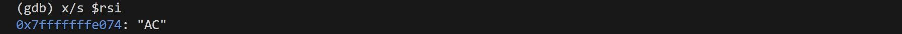

这就是我应输入的字符串。

### phase_5

```
ABDELN
```

phase_5没有sscanf了，而是直接采用我的输入，要求其长度必须为6。然后在一个do-while结构循环若干次，每次进行`1865: add (%rsi,%rdx,4),%ecx`，跳出时要求%ecx必须为0x46才能不炸。循环前，%rsi被赋值为0x555555557200，注释为<array.0>，应该是一个数组。%rax指向我输入的字符串，不断+1，并跟指向字符串末尾的%rdi比较，相等时退出，也就是说会循环6次。每次循环中，%rdx=“%rax所指的字节仅保留低四位”，作为偏移量，然后找到(%rsi+4*%rdx)指向的四字节，让%ecx加上它。

输出%rsi所指的前64个字节：

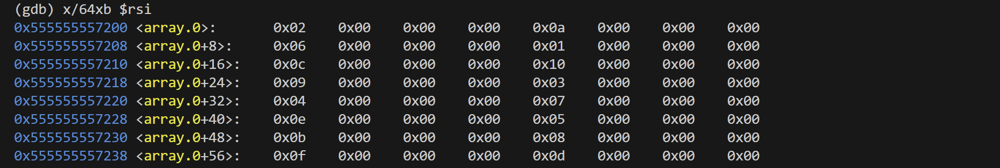

注意是小端序，要倒着看每四个字节。我需要构造6组四字节，加起来等于0x46。可以选0xa+0x6+0xc+0x10+0xb+0xf，对应的偏移量%rdx为十进制的1,2,4,5,12,14。将他们分别+64即可扩展至一个字节并保证可被我输入。对应的字符为：ABDELN。

### phase_6

```
6 3 5 2 4 1
```

phase_6将我的字符串作为第一参数，%rsp的值作为第二参数，调用read_six_numbers函数，在read_six_numbers函数中调用sscanf，格式为"%d %d %d %d %d %d"，将六个int存进%rsp，%rsp+4，%rsp+8，%rsp+12，%rsp+16，%rsp+20。

然后就到了绝望的时刻：跳转逻辑太复杂，一会跳到explode_bomb前，一会又跳到explode_bomb后，我只好极缓慢地一步步边画图边分析，大概理解了程序在干什么，尝试写出了c代码：

```c
// 设我的输入为input[0]...input[5]
for (int r14 = 1; r14 <= 5; r14++){
    int base = input[r14 - 1]; // base是第r14个输入
    if ((unsigned int)(base - 1) > 5){
        explode_bomb();
    }
    for (int rbx = r14; rbx <= 5; rbx++){
        if (input[rbx] == base){
            explode_bomb();
        }
    }
}
```

我注意到了汇编代码中的ja，表明进行的是无符号数的比较！`(unsigned int)(base - 1) > 5`和`base > 6`有很大区别。前者要求base只能是1\~6，而后者的base可以是0\~6。

分析上述代码可知，我只能输入1\~6的一个排列。

接着分析，貌似又有一个循环嵌套，内循环中`mov 0x8(%rdx),%rdx`会重复进行，说明%rdx+8的地方仍然存一个地址。结合注释\<node1\>，推测应该是一个链表。又瞪出了c代码：

```c
for (int rsi = 0; rsi != 6; rsi++){
    int rax = 1;
    node *rdx = &node1;
    if (input[rsi] > 1){
        do{
            rdx = rdx->next;
            rax++;
        } while (rax != input[rsi])
    }
    //然后将第input[rsi]个节点的地址写入内存
}
```

由上述代码可知，程序以我的输入为索引，取了6个节点。结束循环后，程序又将得到的六个节点连成一个新的链表。

最后程序进行了一系列验证：

```c
node *current = head;
for (int i = 5; i != 0; i--){
    if ((current->value) > (current->next->value)){
        explode_bomb();
    }
    current = current->next;
}
```

可知，在新建的链表中如果前驱节点值>后继节点值则爆炸，所以要知道六个节点的value都是多少。经过一个个查看，可知它们是721、323、179、589、288、102，因此我需要按照6、3、5、2、4、1的顺序构建列表。

### secret_phase

```
33113
```

我查找到phase_defused函数末尾调用了secret_phase。phase_defused开头的`cmpl $0x6,0x45be(%rip) #<num_input_strings>`表明当已输入6个字符串时，即在phase_6时，cpml会得到0，从而跳过ret进入附加逻辑！因此我需要在phase_6进行某些操作。

在附加逻辑中，程序会遍历phase_6输入的字符串，遇到空格计一次数，当遍历到\0时跳出，此时若计数不为6则会跳回ret逻辑。我们不能让程序ret，因此需要先在phase_6输入的末尾打一个空格。打了空格后，程序又会因空格数达到6而跳出遍历，而不用等遍历到\0。

跳出后，%rax指向我的字符串，%rsi为12，则%rdi=%rax+%rsi指向空格后第一个字符。程序又将%rsi赋值为"defuse"，然后调用string_not_equal函数。因此我需要让空格后的部分为"defuse"。所以phase_6的输入需要变更为：

```
6 3 5 2 4 1 defuse
```

成功进入了secret_phase。

secret_phase调用了func7，传四个参数：字符串，0，0，0。我发现func7开头先往栈帧存了32个数，末尾递归调用了自己，猜测是在一个固定的地图中找路，每调用一次就重新把地图加载进内存。

尝试让AI帮我大致分析一下func7，发现跟我想得不太一样。这是一个判断象棋中的“马”是否能走到终点的函数，终点为（4,7）。内存中加载的32个数不是地图，而是：前16个数决定每步的8种跳法，后16个数决定蹩马腿的位置。

而每次的走法由我输入的字符串的每个字符决定，该字符会and 0x7，说明程序只关心字符最后 3 个比特位是000\~111中的哪一个，来选择8个走法中的一种。注意到字符'0'\~'7'的末三位恰好是000\~111，因此直接输入0\~7最直观。

程序还要求输入长度不超过20，说明最多只能走20步。

程序还将落点的x坐标和落点的y坐标进行or操作，然后在`1b12: cmp $0x7,%esi`将结果与7比较，说明程序要求新x坐标和新y坐标都只能在0\~7的范围，因此地图为8\*8。

`1b63: lea 0x4646(%rip),%rsi # 61b0 <row0>`和`1b87: lea 0x4622(%rip),%rdx # 61b0 <row0>`加载了两次地图，第一次是为了检查是否蹩马腿，第二次是为了检查落点是否有障碍。我又看到了`mov   0x8(%rsi),%rsi`这样的赋值语句，跟phase_6一样，因此这里的地图也是用链表存储的。查看一下row0的地图信息和下一个row的地址：

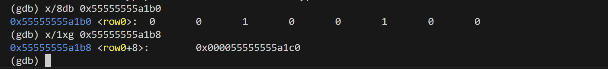

重复8次，得到地图数据（以左下角为原点）。但是从终点倒推可知，无解：

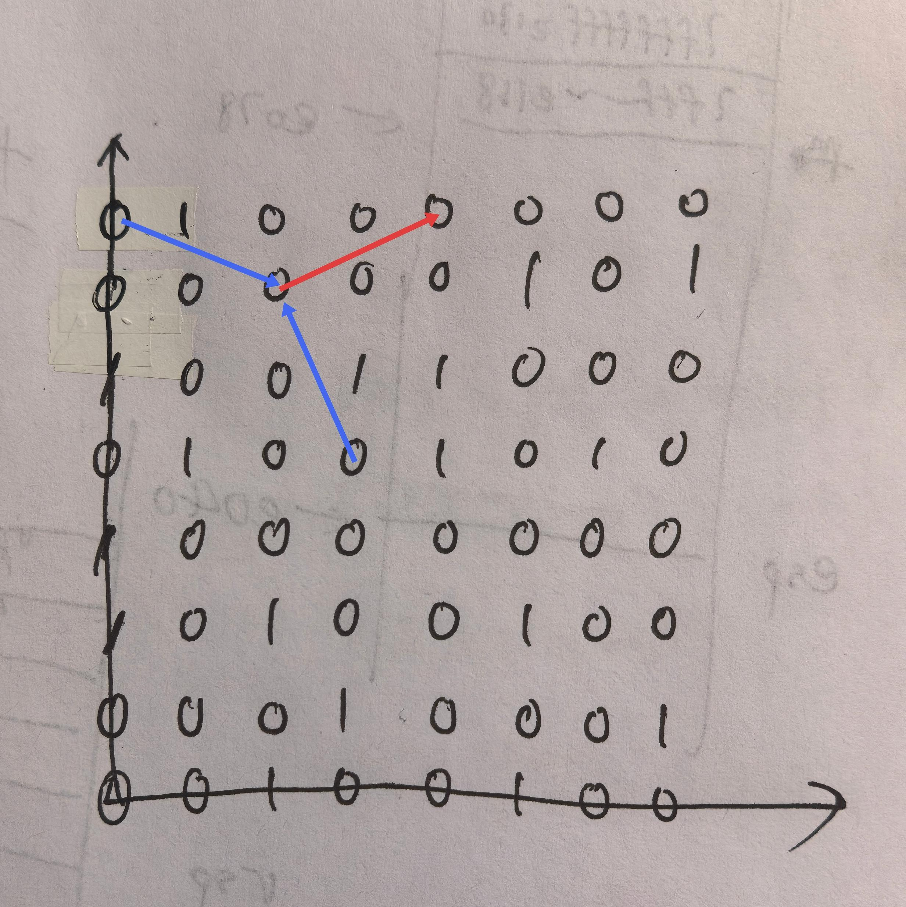

最后一步只有红箭头能通向终点，倒数第二步可能的走法只有两个蓝箭头，但都会被蹩住马腿。

为什么会这样呢？重新审视，我发现汇编中x选择的是row，y决定row中的偏移。而我在绘制地图时是将row沿y方向堆叠，也就是让y选择row，因此错了。

重新绘制地图后，我直接看出了一种解法：

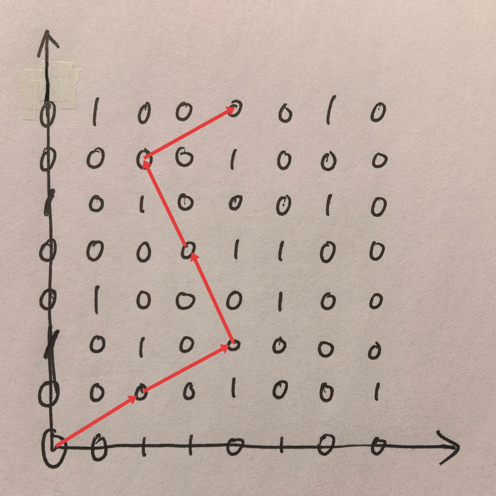

因此走法为：33113。

## 反馈/收获/感悟/总结

<!-- 这一节，你可以简单描述你在这个 lab 上花费的时间/你认为的难度/你认为不合理的地方/你认为有趣的地方 -->

<!-- 或者是收获/感悟/总结 -->

<!-- 200 字以内，可以不写 -->

这个lab确实很有挑战性，一上来phase_2直接给我干傻了。做着做着才逐渐掌握了一些技巧，比如：

- 一定要分清lea和mov
- 先关注explode_bomb附近的触发逻辑，而不用非要从头捋到尾
- 某些地方不用关注实现逻辑而可以直接查看结果
- 要边读汇编边画内存、记录寄存器，而不要嫌麻烦，不然直接被搞晕
- phase_6怒盯三小时有感：不要想着能还原出一模一样的c代码，因为汇编中很多赋值顺序跟人的习惯是很不一致的。重在理解程序大概在干什么

## 参考的重要资料

<!-- 有哪些文章/论文/PPT/课本对你的实现有重要启发或者帮助，或者是你直接引用了某个方法 -->

<!-- 请附上文章标题和可访问的网页路径 -->
